# Developer Guide

## Table of Contents
* [Acknowledgements](#acknowledgements)
* [Design & Implementation](#design--implementation)
* * [Categorising the different books by their genres](#categorising-the-different-books-by-their-genres)
* * [BookList Class Component](#booklist-class-component)
* * [ParserMain Class Component](#parsermain-class-component)
* * [FileStorage Class Component](#filestorage-class-component)
* [Product Scope](#product-scope)
* * [Target user profile](#target-user-profile)
* * [Value proposition](#value-proposition)
* [User Stories](#user-stories)

## Acknowledgements

Reference to AB-3 Developer Guide
* [Source URL](https://se-education.org/addressbook-level3/DeveloperGuide.html#documentation-logging-testing-configuration-dev-ops)
* Used as template to structure this DeveloperGuide
* Reference to AB-3 diagrams code

Reference to AB-3 diagrams code
* [Source URL](https://github.com/se-edu/addressbook-level3/tree/master/docs/diagrams)
* Used as reference to understand PlantUML syntax

## Design & implementation

### BookMain Class
The `BookMain class` represents the core structure of a book within our book management system. Here's a short explanation based on the class diagram below:   
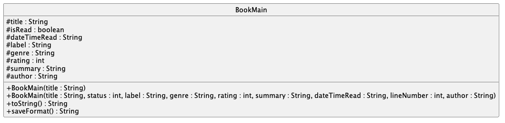
- Attributes: The class has several protected attributes that encapsulate the properties of a book:

  - `title`: A string representing the title of the book.
  - `isRead`: A boolean flag indicating whether the book has been read.
  - `dateTimeRead`: A string capturing the date and time when the book was marked as read.
  - `label`: A string for additional categorization or tagging of the book.
  - `genre`: A string representing the genre the book belongs to.
  - `rating`: An integer storing the user's rating of the book.
  - `summary`: A string providing a brief summary of the book's content.
  - `author`: A string representing the name of the book's author.
  - 
- Constructors: There are two constructors available for creating `BookMain` objects:
  - A single-parameter `BookMain` constructor that accepts the title and sets default values for the other attributes.
  - A multi-parameter `BookMain` constructor that provides a comprehensive way to create a BookMain object with all its attributes 
  - defined, including handling the book's status and ratings.
- Methods:
  - `toString()`: A public method that overrides the default toString method to return a string representation of the 
  - book, including its read status and title.
  - `saveFormat()`: A public method that returns a string formatted with the book's details, suitable for saving to a 
  - text file. This string includes the book's `title`, `author`, `read status`, `date and time read`, `label`, `genre`, `summary`, and `rating`.

This class serves as a fundamental data model in the system, holding all relevant information about a book and providing
methods for constructing book instances and preparing them for display or storage.

### Rating Books from 1 to 5
The rating feature allows users to rate books from a rating of 1 to 5.

#### Overview
The book rating feature in the book management system allows users to assign numerical ratings to books, 
facilitating easier assessment and organization based on quality or preference. This feature enhances user interaction 
by allowing for quick assessments of a book's value or enjoyment level.
- `ParserMain`: Interprets the initial command and delegates to the specific parser.
- `ParserRating`: Processes the rating-related commands.
- `BookRating`: Applies the custom rating to an individual book.

#### Architecture-Level Design
The system utilizes a layered architecture that separates concerns and streamlines interaction across different functionalities:

- `UI Layer`: This layer is responsible for interacting with the user, displaying prompts, and outputs.
- `Command Parser Layer`: Includes parsers that interpret user commands and validate inputs.
- `Data Model Layer`: Manages the book data and handles logic for book operations, including rating updates.

#### Component-Level Design
- `UI`: Manages all interactions with the user, displaying necessary prompts or success/error messages.
- `ParserRating`: Parses and validates user input specifically for setting ratings. It ensures the input includes valid indices and rating values before passing them to the data model.
- `RatingChecks`: Provides utility functions to assist in parsing and validating the parts of the command that deal with numeric indices and ratings.
- `BookList` & `BookRating`: `BookList` maintains a list of books, and `BookRating` handles the logic for setting and retrieving ratings for these books.

#### Implementation Details
- Users initiate the `rate` command with the appropriate index and rating.
- Input Parsing and Validation:
  - `ParserRating.parseSetRating` is called with the user input. It uses `RatingChecks` to split the command into components and validate them.
  - If the index is valid and within the range, and the rating is a number between 1 and 5, the process proceeds.

#### Rating Application:
- `BookRating.setBookRatingByIndex` is invoked to apply the rating. It checks the provided index and rating for validity (e.g., index within range, rating within accepted values).
- If the rating is new or different from the existing rating, it updates the book’s rating in BookList and confirms the update to the user via UI.

#### Rationale for Design
- Consistency and Usability: The command structure is consistent with other features like genre setting, providing a familiar interface for users.
- Robustness: Separate validation steps ensure that only correct and sensible data is processed, improving the system's reliability.
- Scalability: The modular design allows for easy updates and modifications to the rating feature or additions of new features.
  
#### Alternatives Considered
- Integrated Rating Management:  
Initially, there was consideration for integrating rating management directly within the BookList class. However, 
separating it into BookRating respects the Single Responsibility Principle, leading to better organized and more maintainable code.

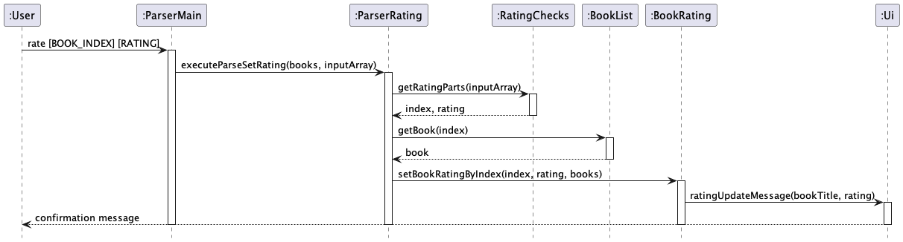

### Listing all Books
This feature allows users to list all books currently added.

#### Overview
The book list feature in the book management system allows users to view all the books they have added at a quick glance. 
This feature enhances user interaction by allowing for a quick overview of all the book titles.
- `ParserMain`: Interprets the initial command and delegates to the specific parser.
- `ParserList`: Processes the list-related commands.
- `BookList`: Maintains the list of books
- `BookDisplay`: Prints out all the books currently in the list.

#### Architecture-Level Design
The system utilizes a layered architecture that separates concerns and streamlines interaction across different functionalities:

- `UI Layer`: This layer is responsible for interacting with the user, displaying prompts, and outputs.
- `Command Parser Layer`: Includes parsers that interpret user commands and validate inputs.
- `Data Model Layer`: Manages the book data and handles logic for book operations, including storing of the books in the list.

#### Component-Level Design
- `UI`: Manages all interactions with the user, displaying necessary prompts or success/error messages.
- `ParserList`: Parses and validates user input specifically for which list to display. It ensures the input does not include extra parameters before passing them to the data model.
- `BookList` & `BookDisplay`: `BookList` maintains a list of books, and `BookDisplay` handles the logic for printing out all these books.

#### Implementation Details
- Users initiate the `list` command.
- Input Parsing and Validation:
  - `ParserList.parseList` is called with the user input. It uses `Exceptions.validateCommandArguments` to check whether there are extra input parameters added.
  - If there are the correct number of parameters give, the command proceeds.

#### Lisitng Application:
- `BookDisplay.printAllBooks` is invoked to print all the books. It checks whether the current booklist is empty and prints out all books if it is not.

#### Rationale for Design
- Consistency and Usability: The command structure is consistent with other list features like list-by-date and list-rated, providing a familiar interface for users.
- Robustness: Separate validation steps ensure that only correct and sensible data is processed, improving the system's reliability.
- Scalability: The modular design allows for easy updates and modifications to the listing feature or additions of new features.

#### Alternatives Considered
- An alternative considered was to have a command that opened the text file in which the data was stored. However, this could lead to issues when the user is trying to comprehend the data as it might not be in a readable format.

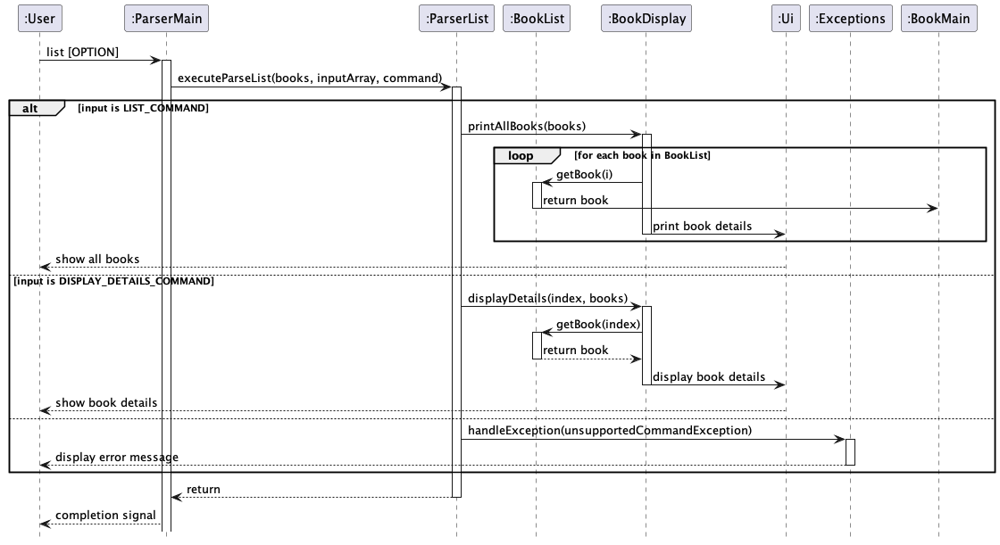

### Labeling Books by Custom Labels
The labeling feature allows users to tag books with custom labels for easy identification and categorization based on personalized criteria.

#### Overview
The process of labeling books is streamlined through several components within the system, each responsible for a part of the task:
`ParserMain`: Interprets the initial command and delegates to the specific parser.
`ParserLabel`: Processes the label-related commands.
`BookLabel`: Applies the custom label to an individual book.

#### Architecture-Level Design
- The book management system continues to utilize a layered architectural approach, encompassing the UI, the command parser, and the data model layers.
- The `set-label` command operates within the command parser layer and communicates with the data model layer to assign labels to books.

#### Component-Level Design
 - `UI Layer`: Serves as the interface between the system and the user, where user commands are received and results are displayed. 
 - `ParserMain` (Command Parser Layer): Functions as the command interpreter, identifying the `set-label` command and directing it to the appropriate parser. 
 - `ParserLabel` (Command Parser Layer): Dedicated to the execution of the `set-label` command, it ensures that user input is correctly interpreted and validated. 
 - `BookList` (Data Model Layer): Holds the collection of books and facilitates operations on them, such as accessing and modifying book details. 
 - `BookLabel` (Data Model Layer): Implements the logic to update a book's label in the `BookList`.

#### Implementation Details
- The user initiates the `set-label` command with the appropriate index and label.
- `ParserMain` catches the command and involves ParserLabel for further processing.
- `ParserLabel` retrieves the relevant book object from BookList using the provided index and assigns the new label.
- Once the label is set, `Ui` is called to deliver a confirmation message back to the user.

#### Rationale for Design
- This design maintains consistency with the `set-genre` feature, providing a uniform command structure and user experience.
- It follows the Single Responsibility Principle, allowing each component to handle a specific part of the task without unnecessary dependencies.

#### Alternatives Considered
- An alternative considered was to have the labeling functionality within a monolithic book management class, but this would have violated the separation of concerns, leading to a less maintainable and scalable system.

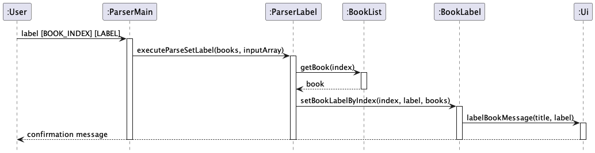

### Categorising the different books by their genres
This functionality enables the categorization of books into distinct groups based on their genres, facilitating better 
organization and tracking. The implementation of this feature involves interactions across multiple classes within the 
system. 

#### Overview
The process of categorizing books by genre is a multistep operation that involves the following classes:
1. `ParserGenre`: This class contains methods that handle the categorization of books.
2. `BookGenre`: Individual book objects are updated with their respective genres directly in this class.
3. `ParserMain`: This class is responsible for parsing the input command to extract the specific index and genre.

#### Architecture-Level Design:

- The book management system is structured using a layered architecture model, comprising the UI layer, the command 
parser layer, and the data model layer.
- The `set-genre` feature is primarily situated in the command parser layer but interacts closely with the data model 
layer to update the genre of a book.

#### Component-Level Design:

- `UI Layer`: Receives input from the user and displays the results of operations. It's where the user's request to set 
  a genre starts and ends with feedback.
- `ParserMain` (Command Parser Layer): Acts as the central hub for command processing, determining the type of command 
  and delegating to the specific parser.
- `ParserGenre` (Command Parser Layer): Specializes in handling the set-genre command. It prompts the user for inputs 
  and validates them.
- `BookList` (Data Model Layer): Maintains the list of books and genres. It's queried to ensure the book index is valid 
  and to retrieve or update the list of genres.
- `BookGenre` (Data Model Layer): Provides the functionality to set the genre of a book in the `BookList`.

#### Implementation Details:

- Upon invoking the `set-genre` command, `ParserMain` interprets the command and forwards it to `ParserGenre`.
 `ParserGenre` then guides the user through selecting an existing genre or adding a new one, ensuring valid inputs at 
  each step.
- The chosen genre is then applied to the specified book through `BookGenre`, which interfaces with `BookList` to make 
  the update.
- Throughout this process, `Ui` is called upon to display messages, guiding the user and confirming the successful 
  update.

#### Rationale for Design:

- The command pattern used allows for easy addition of new commands and features without altering existing code 
  structures, adhering to open/closed principles.
- The clear separation of concerns makes the system robust, with each component focusing on a single responsibility, 
  enhancing maintainability and scalability.

#### Alternatives Considered:

- An embedded approach, where genre setting logic is part of a larger class managing all book attributes, was 
  considered. However, this was rejected due to potential scalability issues and difficulty in maintaining code.

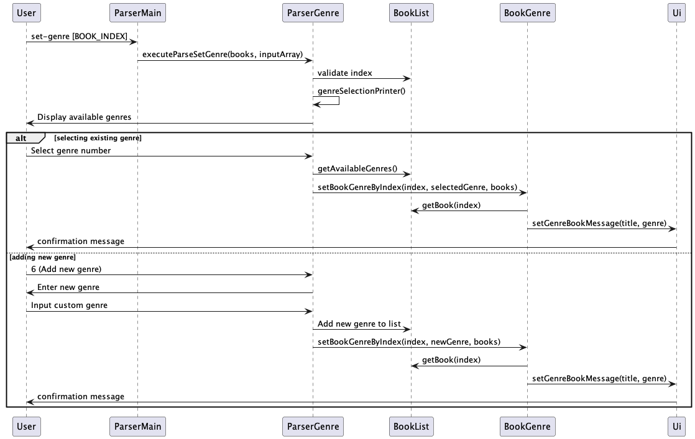

### BookList Class Component
The `BookList` class is responsible for all actions involving the list of books that the user has.

#### Overview

The `BookList` class contains one protected static ArrayList named books. This ArrayList will contain Book objects. The methods in
The `BookList` class contains one protected static ArrayList named books. This ArrayList will contain Book objects. 
The methods in this class all change the ArrayList according to the command given.

#### Detailed Workflow
Apart from the constructor, the methods of this class like getSize(), addBook() all either return a piece of 
information about the ArrayList,
the book object that is selected or change an attribute of the ArrayList or selected book object. For the 
printAllBooks() method, the ArrayList
is iterated through, with the details of each book being printed out according to the toString() format of each book. 
Other than that, methods like
markDoneByIndex() and markUndoneByIndex() both will change the isRead() attribute of the book of the given index. This 
class handles errors related to the
ArrayList, throwing exceptions for invalid indexes and invalid actions based on current state (if trying to mark a book 
that is already read).

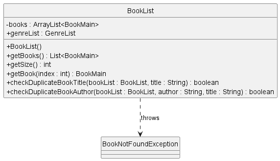

### BookFind Class Component
BookFind class provides functionality to search for books in a list based on various criteria such as title, genre, read status, label, rating, and author.
This allows users to easily locate books based on specific requirements or preferences.

#### Architecture-Level Design
The book management system incorporates the BookFind class under the data model layer, enhancing the system's capability to filter and search books efficiently:

- `UI Layer`: Interacts with the user, receiving input commands for searches and displaying the relevant search results.
- Command Parser Layer: Identifies and parses the search command, then delegates the task to the BookFind class for processing the query.
- Data Model Layer: Executes the search functionality through the BookFind class, accessing and filtering the BookList based on the provided criteria.

#### Component-Level Design
- `UI`: Provides interaction points for input and output, guiding the user through the process and displaying the results of the search.
- `ParserMain` (Command Parser Layer): Serves as the initial interpreter for all commands, including search commands, which it then forwards to the appropriate method in BookFind for action.
- `BookFind` (Data Model Layer): Handles the specifics of each search type (e.g., by title, genre, rating), returning results back to the UI.

#### Implementation Details
`BookFind` includes several methods to support different search criteria:

- `findBookTitle`(BookList bookList, String input): Searches books by titles that contain the given substring.
- `findBookGenre`(BookList bookList, String input): Finds books with an exact genre match.
- `findBookGenreLong`(BookList bookList, String input): Locates books by genres that contain the specified substring.
- `findRead`(BookList bookList): Retrieves all books that have been marked as read.
- `findUnread`(BookList bookList): Retrieves all books that have not been marked as read.
- `findLabel`(BookList bookList, String input): Searches for books with labels containing the given substring.
- `findRate`(BookList bookList, String input): Finds books with the exact rating specified.
- `findAuthor`(BookList bookList, String input): Searches for books by authors whose names contain the given substring.

Each method operates by iterating over the books ArrayList from the BookList class, checking for matches based on the method's criteria. If matches are found, they are added to a result list and printed; 
if no matches are found, a message indicating no results is printed.

#### Rationale for Design
Flexibility and Extensibility: Each search function is implemented as a separate method, allowing easy extension or modification, such as adding new search criteria.
Single Responsibility Principle: BookFind is dedicated solely to the search functionality, making the class more maintainable and the system more robust against changes.

#### Alternatives Considered
Integrated Search within BookList: Initially considered integrating all search functionalities directly into the BookList class. However, separating them into BookFind maintains cleaner code and adheres to the Single Responsibility Principle, enhancing maintainability and scalability.
This design ensures that the system remains adaptable, with BookFind serving a specific role that complements the existing structure without overcrowding individual components. The implementation details provided cater to a broad range of user needs, making the application a comprehensive tool for managing and retrieving book information efficiently.
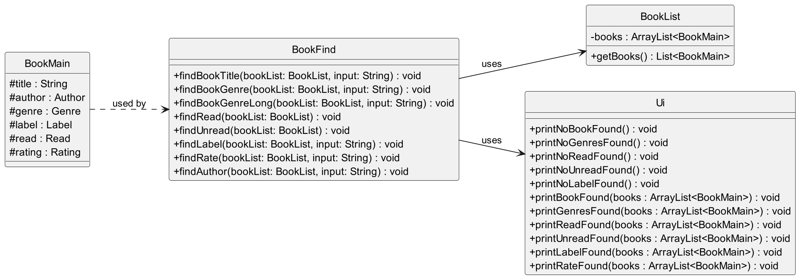

The sequence diagram below shows how user input is processed to carry out the find book command.
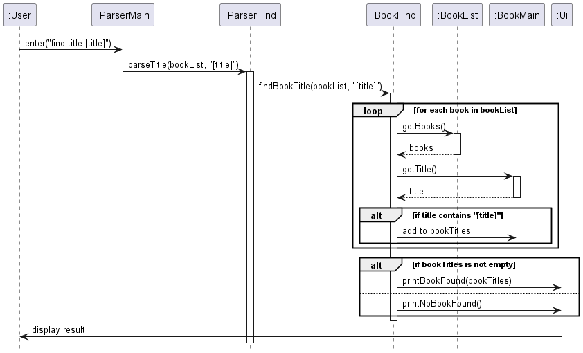

### ParserMain Class Component
The `ParserMain` class is responsible for parsing any input from the user and making sense of them to execute the correct commands.

#### Overview
By importing predefined string constants from `CommandList` class representing the valid commands, the `ParserMain` class 
parses the input from a user using the `parseCommand` method. The class diagram below shows how `ParserMain` interacts with other
classes.
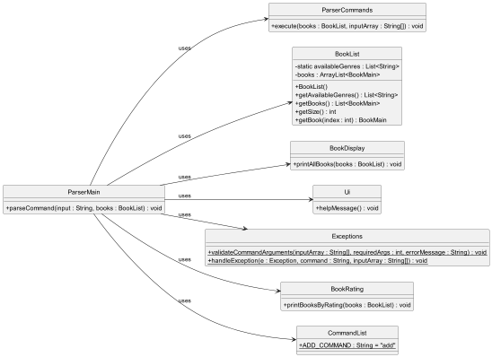

#### Detailed Workflow
Whenever input from the user is detected by the program, the `ParserMain` class will split the command into 2 parts, with the first part
containing the command and the second containing details of the command (if present). The command entered is then evaluated using a
switch statement, with the value of it being compared to the values of each case. In the case of a match, the `ParserMain` class will then
execute the respective action associated with that command by calling other classes from the program such as `BookDisplay` or `ParserAdd`.
This class also handles errors and exceptions associated with the users input. For example, if the user were to give the command `mark` without
specifying an index for which book to mark, or gives a negative number, an appropriate error message will be shown and the command will be rendered
invalid. 

The sequence diagram below shows how user input is processed to carry out the add book command.
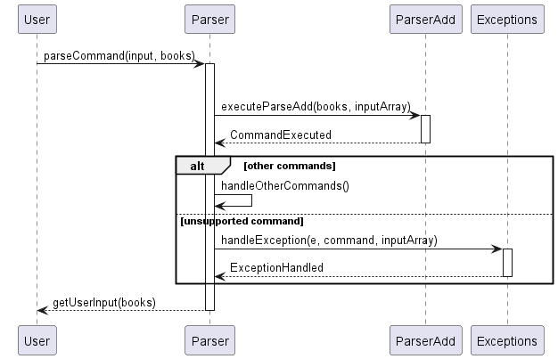

#### Implementation and Rationale
The `ParserMain` class incorporates exception handling to detect invalid or unrecognized commands. This allows the program to continue running
while prompting the user for valid input

By abstracting out the parsing functionality of BookBuddy into a separate `ParserMain` class, the complexity of parsing 
user input is removed from the main code. It is instead replaced by a simple interface for the user to work with, adhering to the abstraction
concept of object-oriented programming.

### Ui Class Component
#### Overview
The Ui class in BookBuddy serves as the primary interaction point between the user and the system. 
It facilitates the display of messages, user prompts, and the outcomes of commands executed within the application.

#### Implementation Details
The `Ui` class is composed entirely of static methods, meaning that the state is not maintained between method calls, and no instance of Ui is ever created. 
This design choice reflects the stateless nature of console outputs and simplifies method invocations without needing to pass around a Ui object.

For commands that result in lists (such as finding books or listing genres), the `Ui` class provides methods like 
printBookFound(), printGenresFound(), printReadFound(), and others to iterate over the list of books and display each one with a numeric index.

#### Rationale for Design
- Consistency: The Ui class provides a consistent interface for all user messages, which is crucial for a cohesive user experience.
- Simplicity: Static methods in the Ui class simplify the calling code, as there is no need to manage Ui instances.
- Maintenance: Centralizing user interface code in one class makes the application easier to maintain and update.
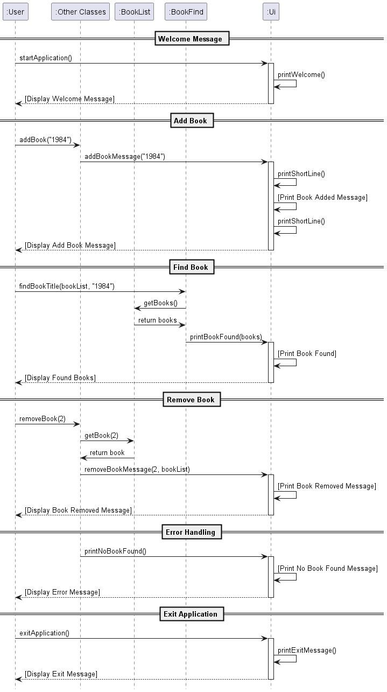

### FileStorage Class Component
The `FileStorage` class is crucial for managing file operations in BookBuddy, such as reading from and writing to files, 
thereby ensuring data is saved for future sessions.

#### Overview
The `FileStorage` class interacts with the `BookList` and `BookListModifier` classes to load and save book data. It ensures that 
the data directory and file exist upon initialization and provides methods for reading from and writing to the data file. 
The class diagram below illustrates the relationship between `FileStorage` and other classes.

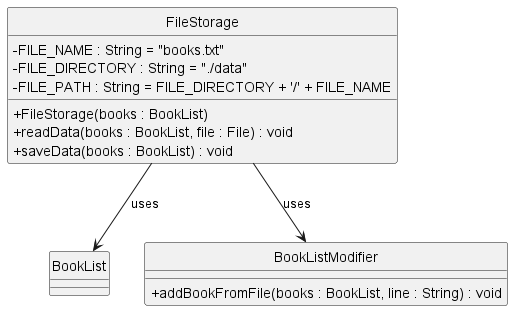

#### Detailed Workflow
Upon instantiation, the `FileStorage` class checks for the existence of a predefined directory (./data) and file (books.txt),
creating them if they do not exist. Existing data, if any, is read from the file and BookBuddy's BookList is initialized
with this data. For reading data, it scans each line of the file, converting each line of text into instances of `Book` with
the appropriate details. For saving data, it iterates through the BookList, converting each book into a string format suitable 
for file storage and writes this to the file.

#### Implementation and Rationale
The creation of the `FileStorage` class ensures that all features related to reading and writing data is taken away from other
parts of the application. This separation makes the `FileStorage` class solely responsible for these features, adhering to
the Single Responsibility Principle.

## Product scope
### Target user profile

Users that want an all-in-one app to track their books read and also record details relevant to the book.
Users will be able to sort books according to genre.
Users can sort books according to Read or Unread.
Users will also be able to search for books via keywords in book titles

### Value proposition

Saves time and effort as compared to using GUI-based book tracking apps.

## User Stories

| Version | As a ... | I want to ...                                   | So that I can ...                                             |
|---------|----------|-------------------------------------------------|---------------------------------------------------------------|
| v1.0    | new user | see usage instructions                          | refer to them when I forget how to use the application        |
| v1.0    | user     | add books to a list                             |                                                               |
| v1.0    | user     | remove books from a list                        |                                                               |
| v1.0    | user     | see the list of books that are read or unread   | I can keep track of my reading progress                       |
| v1.0    | user     | change the status of a book                     | mark a book when I have finished reading it                   |
| v2.0    | user     | view the date that I finished reading each book | know how long I take to finish a book                         |
| v2.0    | user     | add an author for a book                        | differentiate between books with the same title               |
| v2.0    | user     | add a summary to a book                         | remember what the book is about                               |
| v2.0    | user     | provide a label for a book                      | provide my own personal thoughts on the book                  |
| v2.0    | user     | provide a genre for a book                      | categorise books according to their genre                     |
| v2.0    | user     | provide a rating for a book                     | know whether a book was good or not                           |
| v2.0    | user     | sort books by their rating                      | recall which are the best books that I have read              |
| v2.0    | user     | view all information about a book               | remember to add missing information (if any)                  |
| v2.0    | user     | filter books by title                           | find a book quickly without going through the entire list     |
| v2.0    | user     | filter books by genre                           | see all the books in a particular genre                       |
| v2.0    | user     | filter books by status                          | remember which books I have read / yet to read                |
| v2.0    | user     | filter books by label                           | see the list of books which I have assigned a custom label to |
| v2.0    | user     | filter books by specific rating                 | view a smaller list of books of a certain score               |
| v2.0    | user     | filter books by author                          | find the books written by my favorite author                  |

