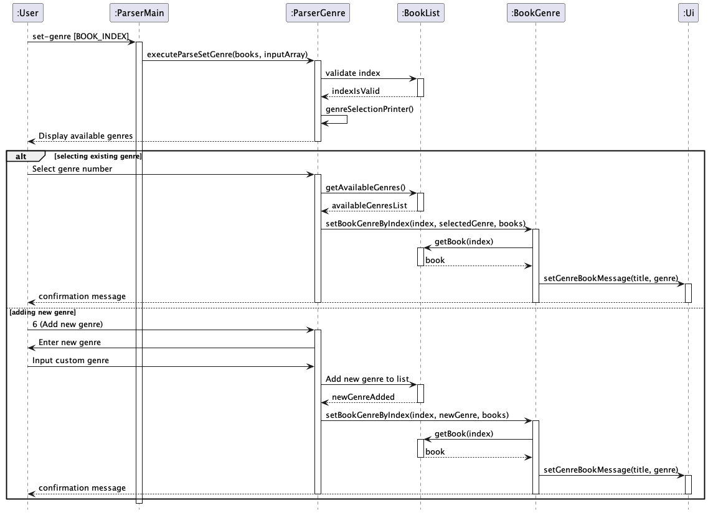
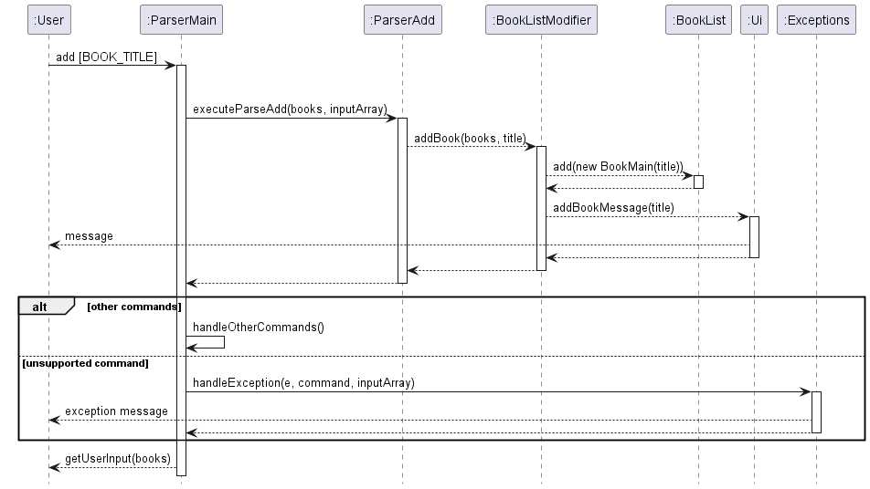

# Developer Guide

## Table of Contents
* [Acknowledgements](#acknowledgements)
* [Design & Implementation](#design--implementation)
* * [Categorising the different books by their genres](#categorising-the-different-books-by-their-genres)
* * [BookList Class Component](#booklist-class-component)
* * [ParserMain Class Component](#parsermain-class-component)
* * [FileStorage Class Component](#filestorage-class-component)
* [Product Scope](#product-scope)
* * [Target user profile](#target-user-profile)
* * [Value proposition](#value-proposition)
* [User Stories](#user-stories)

## Acknowledgements

{list here sources of all reused/adapted ideas, code, documentation, and third-party libraries -- include links to the original source as well}

Reference to AB-3 Developer Guide
* [Source URL](https://se-education.org/addressbook-level3/DeveloperGuide.html#documentation-logging-testing-configuration-dev-ops)
* Used as template to structure this DeveloperGuide
* Reference to AB-3 diagrams code

Reference to AB-3 diagrams code
* [Source URL](https://github.com/se-edu/addressbook-level3/tree/master/docs/diagrams)
* Used as reference to understand PlantUML syntax

## Design & implementation

{Describe the design and implementation of the product. Use UML diagrams and short code snippets where applicable.}

### Categorising the different books by their genres
This functionality enables the categorization of books into distinct groups based on their genres, facilitating better 
organization and tracking. The implementation of this feature involves interactions across multiple classes within the 
system. 

#### Overview
The process of categorizing books by genre is a multistep operation that involves the following classes:
1. `ParserGenre`: This class contains methods that handle the categorization of books.
2. `BookGenre`: Individual book objects are updated with their respective genres directly in this class.
3. `ParserMain`: This class is responsible for parsing the input command to extract the specific index and genre.

#### Architecture-Level Design:

- The book management system is structured using a layered architecture model, comprising the UI layer, the command 
parser layer, and the data model layer.
- The `set-genre` feature is primarily situated in the command parser layer but interacts closely with the data model 
layer to update the genre of a book.

#### Component-Level Design:

- `UI Layer`: Receives input from the user and displays the results of operations. It's where the user's request to set 
  a genre starts and ends with feedback.
- `ParserMain` (Command Parser Layer): Acts as the central hub for command processing, determining the type of command 
  and delegating to the specific parser.
- `ParserGenre` (Command Parser Layer): Specializes in handling the set-genre command. It prompts the user for inputs 
  and validates them.
- `BookList` (Data Model Layer): Maintains the list of books and genres. It's queried to ensure the book index is valid 
  and to retrieve or update the list of genres.
- `BookGenre` (Data Model Layer): Provides the functionality to set the genre of a book in the `BookList`.

#### Implementation Details:

- Upon invoking the `set-genre` command, `ParserMain` interprets the command and forwards it to `ParserGenre`.
 `ParserGenre` then guides the user through selecting an existing genre or adding a new one, ensuring valid inputs at 
  each step.
- The chosen genre is then applied to the specified book through `BookGenre`, which interfaces with `BookList` to make 
  the update.
- Throughout this process, `Ui` is called upon to display messages, guiding the user and confirming the successful 
  update.

#### Rationale for Design:

- The command pattern used allows for easy addition of new commands and features without altering existing code 
  structures, adhering to open/closed principles.
- The clear separation of concerns makes the system robust, with each component focusing on a single responsibility, 
  enhancing maintainability and scalability.

#### Alternatives Considered:

- An embedded approach, where genre setting logic is part of a larger class managing all book attributes, was 
  considered. However, this was rejected due to potential scalability issues and difficulty in maintaining code.

### BookList Class Component
The `BookList` class is responsible for all actions involving the list of books that the user has.

#### Overview

The `BookList` class contains one protected static ArrayList named books. This ArrayList will contain Book objects. The methods in
The `BookList` class contains one protected static ArrayList named books. This ArrayList will contain Book objects. 
The methods in this class all change the ArrayList according to the command given.

#### Detailed Workflow
Apart from the constructor, the methods of this class like getSize(), addBook() all either return a piece of 
information about the ArrayList,
the book object that is selected or change an attribute of the ArrayList or selected book object. For the 
printAllBooks() method, the ArrayList
is iterated through, with the details of each book being printed out according to the toString() format of each book. 
Other than that, methods like
markDoneByIndex() and markUndoneByIndex() both will change the isRead() attribute of the book of the given index. This 
class handles errors related to the
ArrayList, throwing exceptions for invalid indexes and invalid actions based on current state (if trying to mark a book 
that is already read).

#### Implementation and Rationale

### ParserMain Class Component
The `ParserMain` class is responsible for parsing any input from the user and making sense of them to execute the correct commands.

#### Overview
By importing predefined string constants from `CommandList` class representing the valid commands, the `ParserMain` class 
parses the input from a user using the `parseCommand` method. The class diagram below shows how `ParserMain` interacts with other
classes.

#### Detailed Workflow
Whenever input from the user is detected by the program, the `ParserMain` class will split the command into 2 parts, with the first part
containing the command and the second containing details of the command (if present). The command entered is then evaluated using a
switch statement, with the value of it being compared to the values of each case. In the case of a match, the `ParserMain` class will then
execute the respective action associated with that command by calling other classes from the program such as `BookDisplay` or `ParserAdd`.
This class also handles errors and exceptions associated with the users input. For example, if the user were to give the command `mark` without
specifying an index for which book to mark, or gives a negative number, an appropriate error message will be shown and the command will be rendered
invalid. 

The sequence diagram below shows how user input is processed to carry out the add book command.

#### Implementation and Rationale
The `ParserMain` class incorporates exception handling to detect invalid or unrecognized commands. This allows the program to continue running
while prompting the user for valid input

By abstracting out the parsing functionality of BookBuddy into a separate `ParserMain` class, the complexity of parsing 
user input is removed from the main code. It is instead replaced by a simple interface for the user to work with, adhering to the abstraction
concept of object-oriented programming.

### FileStorage Class Component
The `FileStorage` class is crucial for managing file operations in BookBuddy, such as reading from and writing to files, 
thereby ensuring data is saved for future sessions.

#### Overview
The `FileStorage` class interacts with the `BookList` and `BookListModifier` classes to load and save book data. It ensures that 
the data directory and file exist upon initialization and provides methods for reading from and writing to the data file. 
The class diagram below illustrates the relationship between `FileStorage` and other classes.

#### Detailed Workflow
Upon instantiation, the `FileStorage` class checks for the existence of a predefined directory (./data) and file (books.txt),
creating them if they do not exist. Existing data, if any, is read from the file and BookBuddy's BookList is initialized
with this data. For reading data, it scans each line of the file, converting each line of text into instances of `Book` with
the appropriate details. For saving data, it iterates through the BookList, converting each book into a string format suitable 
for file storage and writes this to the file.

#### Implementation and Rationale
The creation of the `FileStorage` class ensures that all features related to reading and writing data is taken away from other
parts of the application. This separation makes the `FileStorage` class solely responsible for these features, adhering to
the Single Responsibility Principle.

## Product scope
### Target user profile

Users that want an all-in-one app to track the books read, progress for each book.
Progress for each book can be recorded according to the number of pages read.
Users will be able to sort books according to genre.
Users can sort books according to Read or Unread.
Users will also be able to search for books via keywords in book titles

### Value proposition

{Describe the value proposition: what problem does it solve?}

## User Stories

| Version | As a ... | I want to ...                                 | So that I can ...                                         |
|---------|----------|-----------------------------------------------|-----------------------------------------------------------|
| v1.0    | new user | see usage instructions                        | refer to them when I forget how to use the application    |
| v1.0    | user     | add books to a list                           |                                                           |
| v1.0    | user     | remove books from a list                      |                                                           |
| v1.0    | user     | see the list of books that are read or unread | I can keep track of my reading progress                   |
| v1.0    | user     | change the status of a book                   | mark a book when I have finished reading it               |
| v2.0    | user     | add a summary to a book                       | remember what the book is about                           |
| v2.0    | user     | provide a label for a book                    | provide my own personal thoughts on the book              |
| v2.0    | user     | provide a genre for a book                    | categorise books according to their genre                 |
| v2.0    | user     | provide a rating for a book                   | know whether a book was good or not                       |
| v2.0    | user     | sort books by their rating                    | recall which are the best books that I have read          |
| v2.0    | user     | view all information about a book             | remember to add missing information (if any)              |
| v2.0    | user     | search for books according to keywords        | find a book quickly without going through the entire list |
| v2.0    | user     | filter books by genre                         | see all the books in a particular genre                   |

## Non-Functional Requirements

{Give non-functional requirements}

## Glossary

* *glossary item* - Definition

## Instructions for manual testing

{Give instructions on how to do a manual product testing e.g., how to load sample data to be used for testing}
